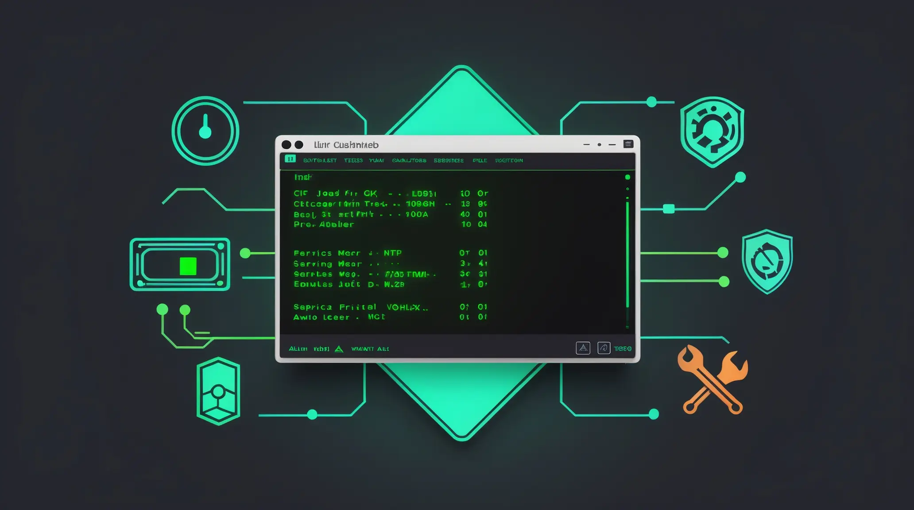

# Linux Auto-Debug & Self-Heal

> **Automated Linux triage and remediation — read-only diagnostics or full self-healing with a single flag.**

A portable Bash script built for real-world production servers. It detects the OS family (Ubuntu/Debian vs RHEL/Alma/Rocky), runs a comprehensive baseline health report, and optionally applies safe remediations — no external dependencies, no Python, no pip.

Used to diagnose and stabilize Linux servers across cloud and on-prem environments in Bay Area SMB and enterprise settings.


---

## Quick Run (Read-Only, No Install)

```bash
curl -sSL https://raw.githubusercontent.com/suresh-1001/linux-auto-debug/main/linux-autodebug.sh | sudo bash
```

---

## Installation

```bash
git clone https://github.com/suresh-1001/linux-auto-debug.git
cd linux-auto-debug
chmod +x linux-autodebug.sh
```

---

## Usage

| Command | What it does |
|---|---|
| `sudo ./linux-autodebug.sh` | Read-only baseline report |
| `sudo ./linux-autodebug.sh --apply` | Baseline + safe auto-remediations |
| `sudo ./linux-autodebug.sh --apply --aggressive` | Also restarts processes holding deleted log files |
| `sudo ./linux-autodebug.sh --apply --report /root/health-$(date +%F).txt` | Saves full report to file |

---

## What It Checks

**System Health**
- Uptime, load average, CPU & memory top offenders
- Filesystem usage with alerting at 85% threshold
- Biggest space consumers under `/var` and `/var/log`
- Files deleted-but-still-open (a common cause of unreclaimed disk space)

**Network & DNS**
- Interface status, routing table
- Listening ports (security surface review)
- `/etc/resolv.conf` validation — alerts if no valid nameservers found

**Services & Logs**
- All running systemd services
- Failed unit detection with pre-remediation log capture
- `journalctl -p 3` errors + syslog/messages grep for `error|warn|fail`

**Time & Security**
- NTP sync status via `timedatectl`
- SELinux enforcement mode on RHEL-family hosts

---

## What It Fixes (`--apply`)

| Fix | Detail |
|---|---|
| Restart failed services | Logs status before and after |
| Vacuum systemd journals | Caps at 200MB or 7 days |
| Force logrotate | Runs `logrotate -f /etc/logrotate.conf` |
| Truncate oversized logs | Logs >300MB under `/var/log` |
| Clean package caches | `apt-get clean` or `dnf clean all` |
| Clear stale `/tmp` | Files older than 7 days |
| DNS fallback | Appends `1.1.1.1` / `8.8.8.8` if no valid resolvers found |
| Enable NTP | Starts `systemd-timesyncd` or `chronyd` if not synced |
| Restart processes holding deleted files | `--aggressive` only |

---

## Example Output

```
=== Linux Auto-Debug + Self-Heal ===
Host: prod-web-01   |   Time (UTC): 2025-09-29T20:30:00Z
----------------------------------------------
[System] Uptime / Load
  20:30:00 up 12 days, 4:11,  1 user,  load average: 0.08, 0.11, 0.09

[Disk] ALERT: /var at 91% used (/dev/sda1)
[Services] Failed services
  nginx.service
  postgresql.service

=== APPLY MODE: Performing safe remediations ===
[Fix] Restarting FAILED services
 -> nginx.service (logs last 30 lines)
 -> postgresql.service (logs last 30 lines)
[Fix] Vacuuming systemd journals (200M OR 7d)
[Fix] Truncating very large logs (>300MB) under /var/log

============================================================
[Final Summary - Plain English]
- ✅ System load is normal (0.08).
- ✅ Memory is healthy (1842MB available).
- ⚠️ Root filesystem is 91% full. Free up space soon.
- ✅ No critical kernel I/O errors detected.
- ✅ All systemd services are running normally.
- ✅ System clock is synchronized via NTP.

[Verdict] Overall system health looks stable unless flagged above.
============================================================
```

See a full sample run: [`examples_output.txt`](./examples_output.txt)

---

## Tested On

| Distro | Version |
|---|---|
| Ubuntu | 22.04 LTS, 24.04 LTS |
| AlmaLinux | 8, 9, 10 |
| Rocky Linux | 8, 9 |
| Debian | 11, 12 |

---

## Why This Exists

Most Linux issues in SMB environments fall into a short list of categories — full disks, failed services, stale logs, DNS gaps, and clock drift. This script was built to cover all of them in a single pass, with zero external dependencies and output that's readable by both engineers and clients.

The `--apply` mode is deliberately conservative: it vacuums rather than deletes, restarts rather than removes, and backs up before touching system files.

---

## Repository Structure

```
linux-auto-debug/
├── linux-autodebug.sh      # Main script
├── examples_output.txt     # Full sample run output
├── README.md
└── LICENSE                 # MIT
```

---

## 👤 Author

**Suresh Chand** — IT Consultant & Fractional IT Director, San Jose CA  
20+ years in Linux systems administration, VMware, Azure, and SMB infrastructure.

---

## 🔗 Related

- [linux-server-onboarding-baseline](https://github.com/suresh-1001/linux-server-onboarding-baseline) — harden a server before debugging it
- [linux-cis-audit](https://github.com/suresh-1001/linux-cis-audit) — CIS Benchmark audit and remediation
- [prometheus-grafana-stack](https://github.com/suresh-1001/prometheus-grafana-stack) — monitor the servers you just fixed

---

## 📜 License

MIT — free to use, modify, and distribute.
